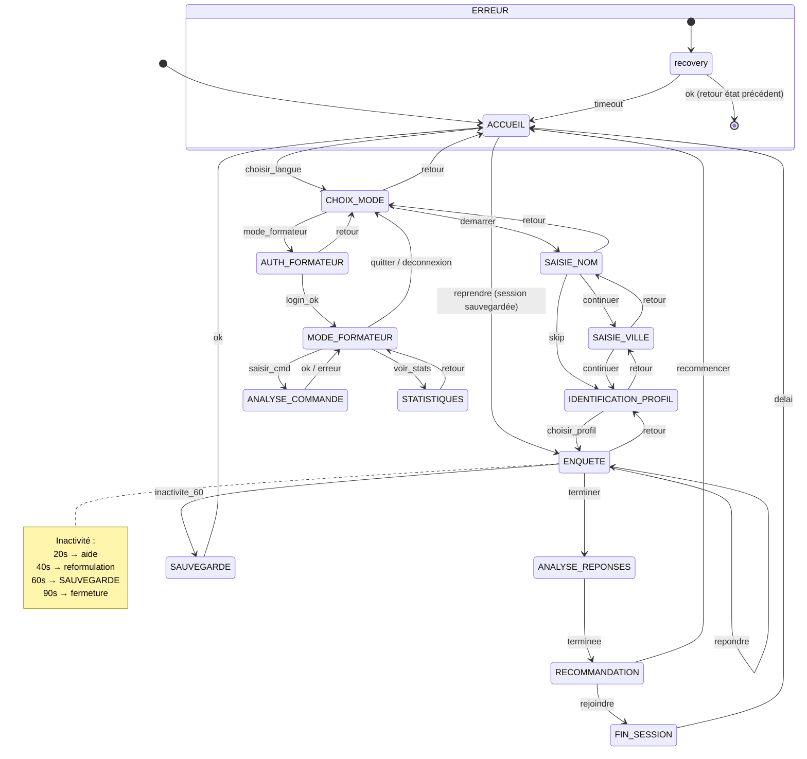

# Diagramme d'états — KebaCode CCC

## Automate fini (FSM)

Implémentation : `kebacode-ccc/assets/js/engine.js`

---

## Diagramme global



---

## Liste des états

| État | Description | Écran |
|------|-------------|-------|
| `ACCUEIL` | Splash multilingue, reprise session | `accueil.js` |
| `CHOIX_MODE` | Candidat ou Formateur | `choix-role.js` |
| `SAISIE_NOM` | Collecte prénom (optionnel) | `nom.js` |
| `SAISIE_VILLE` | Sélection ville RDC | `ville.js` |
| `IDENTIFICATION_PROFIL` | Enfant / Ado / Parent / Visiteur | `profil.js` |
| `ENQUETE` | Conversation adaptative | `enquete.js` |
| `ANALYSE_REPONSES` | Animation « Keba réfléchit » | `analyse.js` |
| `RECOMMANDATION` | Parcours + PDF | `recommandation.js` |
| `AUTH_FORMATEUR` | Connexion encadreur | `auth-formateur.js` |
| `MODE_FORMATEUR` | Terminal mini-français | `formateur.js` |
| `ANALYSE_COMMANDE` | Parsing LL(1) d'une commande | `formateur.js` |
| `STATISTIQUES` | Tableau de bord graphique | `statistiques.js` |
| `ERREUR` | État de récupération | toast / retour |
| `SAUVEGARDE` | Persistance forcée (inactivité) | toast + redirect |
| `FIN_SESSION` | Clôture avec countdown | `fin.js` |

---

## Détail par état

### ACCUEIL

| | |
|---|---|
| **Entrées** | Toucher écran, choix langue, reprendre session |
| **Sorties** | Rendu splash, bouton reprise si session existante |
| **Transitions** | `choisir_langue` → CHOIX_MODE ; `reprendre` → état sauvegardé |
| **Erreurs** | localStorage corrompu → nouvelle session |
| **Condition** | `reprendre` nécessite `contexte.etatSauvegarde` |

### ENQUETE

| | |
|---|---|
| **Entrées** | Choix réponse, texte libre, terminer |
| **Sorties** | Fil de chat, barre progression, questions adaptées |
| **Transitions** | `repondre` (boucle), `terminer` → ANALYSE, `inactivite_60` → SAUVEGARDE |
| **Erreurs** | Réponse vide → bouton désactivé |
| **Condition** | Questions filtrées par `profil_cible` et flags conversation |

### MODE_FORMATEUR

| | |
|---|---|
| **Entrées** | Commande texte, boutons suggestions, voir stats |
| **Sorties** | Historique terminal, tokens colorés, mini-dashboard |
| **Transitions** | `saisir_cmd` → ANALYSE_COMMANDE ; `voir_stats` → STATISTIQUES |
| **Erreurs** | Commande invalide → message 3 niveaux, reste en MODE_FORMATEUR |
| **Condition** | Auth formateur valide (TTL 8 h) |

### ANALYSE_COMMANDE

| | |
|---|---|
| **Entrées** | Résultat `parse(line)` |
| **Sorties** | Trace LL(1), exécution action, journalisation |
| **Transitions** | `ok` ou `erreur` → MODE_FORMATEUR |
| **Erreurs** | Niveau 1/2/3 selon confiance Levenshtein |

---

## Matrice de transitions (extrait)

Source : `engine.js` → `TRANSITIONS`

```
État courant          │ Événement        │ État suivant
──────────────────────┼──────────────────┼─────────────────────
ACCUEIL               │ choisir_langue   │ CHOIX_MODE
ACCUEIL               │ reprendre        │ (état sauvegardé)
CHOIX_MODE            │ demarrer         │ SAISIE_NOM
CHOIX_MODE            │ mode_formateur   │ AUTH_FORMATEUR
SAISIE_NOM            │ continuer        │ SAISIE_VILLE
SAISIE_NOM            │ skip             │ IDENTIFICATION_PROFIL
SAISIE_VILLE          │ continuer        │ IDENTIFICATION_PROFIL
IDENTIFICATION_PROFIL │ choisir_profil   │ ENQUETE
ENQUETE               │ repondre         │ ENQUETE
ENQUETE               │ terminer         │ ANALYSE_REPONSES
ENQUETE               │ inactivite_60    │ SAUVEGARDE
ANALYSE_REPONSES      │ terminee         │ RECOMMANDATION
RECOMMANDATION        │ rejoindre        │ FIN_SESSION
RECOMMANDATION        │ recommencer      │ ACCUEIL
AUTH_FORMATEUR        │ login_ok         │ MODE_FORMATEUR
MODE_FORMATEUR        │ saisir_cmd       │ ANALYSE_COMMANDE
MODE_FORMATEUR        │ voir_stats       │ STATISTIQUES
ANALYSE_COMMANDE      │ ok / erreur      │ MODE_FORMATEUR
SAUVEGARDE            │ ok               │ ACCUEIL
FIN_SESSION           │ delai            │ ACCUEIL
* (invalide)          │ *                │ ERREUR
```

---

## Gestion de l'inactivité

Classe `InactivityManager` — timers en cascade :

```
t=0        Activité utilisateur → reset timers
t=20s      onAide()      → bulle contextuelle (profil-adaptée)
t=40s      onReformuler() → reformulation question / suggestion commande
t=60s      onSauvegarder() → FSM → SAUVEGARDE + persistToDb()
t=90s      onFermer()    → countdown + FIN_SESSION → ACCUEIL
```

Messages adaptés :

- **Enfant** : formulations simples, emojis
- **Adolescent** : ton direct
- **Formateur** : suggestion de commande (`aide`, `afficher les statistiques`)

---

## Persistance et reprise

```javascript
// Sauvegarde (engine.js)
localStorage.setItem('ccc_session_v1', JSON.stringify({
  etat: 'ENQUETE',
  contexte: { lang, userName, ville, profile, conversation, answers, ... },
  savedAt: Date.now()
}));

// + Supabase si en ligne
sauvegarderProgression(sessionId, etat, contexteJSON);
```

Reprise : au `init()`, si session trouvée → bouton « Reprendre » sur ACCUEIL → `fsm.transition('reprendre', { etatSauvegarde })`.

---

## Journal FSM (console)

Chaque transition log :

```
[FSM] ENQUETE → ANALYSE_REPONSES (event: terminer)
[FSM] Session restaurée → ENQUETE
[FSM] Reset → ACCUEIL
```

Voir [JOURNAL_EXECUTION.md](JOURNAL_EXECUTION.md) pour des traces complètes.
