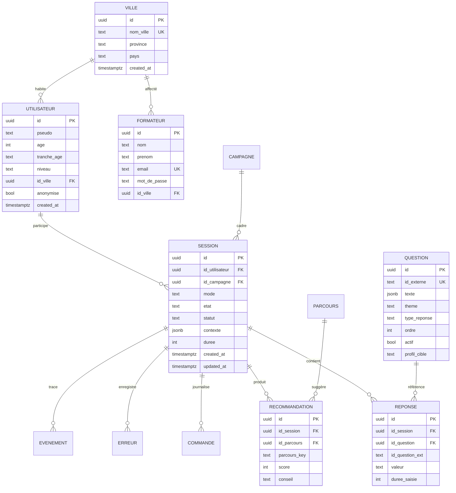

# Modèle de données — KebaCode CCC

**SGBD** : PostgreSQL (Supabase)  
**Script** : `kebacode-ccc/supabase/schema.sql`

---

## Diagramme entité-relation



---

## Tables (12)

### `ville`

Référentiel des villes RDC couvertes par CCC.

| Colonne | Type | Contrainte |
|---------|------|------------|
| id | UUID | PK, auto |
| nom_ville | TEXT | NOT NULL, UNIQUE |
| province | TEXT | |
| pays | TEXT | DEFAULT 'RDC' |

**Données seed** : Kinshasa, Lubumbashi, Goma, Bukavu, Kisangani, Matadi.

### `utilisateur`

Participant à une session (pseudo, profil, ville).

| Colonne | Type | Contrainte |
|---------|------|------------|
| pseudo | TEXT | Prénom saisi |
| tranche_age | TEXT | ex. `6–12`, `13–17` |
| id_ville | UUID | FK → ville |
| anonymise | BOOLEAN | DEFAULT false |

### `session`

Unité de travail — lie utilisateur, campagne et contexte JSON.

| Colonne | Type | Contrainte |
|---------|------|------------|
| mode | TEXT | `public` \| `formateur` |
| etat | TEXT | État FSM courant |
| statut | TEXT | `en_cours` \| `terminee` \| `abandonnee` |
| contexte | JSONB | État complet de l'app (answers, profile, lang…) |
| duree | INTEGER | Durée en secondes |

### `question`

Banque de questions multilingues (JSONB `{fr, en, ln, sw}`).

| Colonne | Type | Contrainte |
|---------|------|------------|
| id_externe | TEXT | UNIQUE (ex. `q1`) |
| texte | JSONB | NOT NULL |
| theme | TEXT | Découverte, Cybersécurité… |
| type_reponse | TEXT | `closed` \| `open` |
| profil_cible | TEXT | `tous` \| `enfant` \| `ado` \| `adulte` |
| actif | BOOLEAN | Soft delete |

### `reponse`

Réponse enregistrée par session.

| Colonne | Type | Description |
|---------|------|-------------|
| valeur | TEXT | Texte ou choix |
| duree_saisie | INTEGER | Temps de réponse (ms) |
| id_question_ext | TEXT | Référence externe si pas d'UUID |

### `parcours`

Catalogue des parcours CCC.

**Seed** : Découverte numérique, Scratch→Python, Mentor Junior, Cybersécurité Jeunes.

### `recommandation`

Résultat du moteur de recommandation par session.

| Colonne | Type | Description |
|---------|------|-------------|
| parcours_key | TEXT | Clé algo (`enfant`, `ado`, `mentor`…) |
| score | INTEGER | Score calculé |
| conseil | TEXT | Message personnalisé |

### `campagne`

Campagnes thématiques lancées par formateurs.

**Seed** : « Campagne Cybersécurité 2026 ».

### `commande`

Journal des commandes formateur (audit).

| Colonne | Type | Description |
|---------|------|-------------|
| texte_brut | TEXT | Saisie originale |
| texte_corrige | TEXT | Après auto-correction |
| action | TEXT | Verbe normalisé |
| objet | TEXT | Cible |
| statut | TEXT | `ok` \| `erreur` \| `corrige` |

### `erreur`

Journal des erreurs système et commandes.

| Colonne | Type | Description |
|---------|------|-------------|
| type_erreur | TEXT | `commande`, `syntaxe`, `db`… |
| entree_fautive | TEXT | Token ou commande fautive |
| message | TEXT | Message utilisateur |

### `evenement`

Trace des transitions FSM (optionnel).

| Colonne | Type | Description |
|---------|------|-------------|
| type_evt | TEXT | `transition`, `timeout`… |
| etat_avant / etat_apres | TEXT | États FSM |

### `formateur`

Comptes encadreurs (mot de passe hashé SHA-256).

**RPC** : `verifier_formateur(email, mot_de_passe)` — SECURITY DEFINER, accessible à `anon`.

---

## Vues statistiques (4)

| Vue | Description |
|-----|-------------|
| `v_stats_par_ville` | Sessions et participants par ville |
| `v_tableau_bord` | Taux complétion, abandons, durée moyenne par campagne |
| `v_erreurs_frequentes` | Top 20 erreurs commandes |
| `v_parcours_populaires` | Recommandations par parcours |

---

## Requêtes SQL métier (15+)

| # | Fonction JS | Requête / Vue |
|---|-------------|---------------|
| 1 | `creerUtilisateur` | INSERT utilisateur + FK ville |
| 2 | `creerSession` | INSERT session |
| 3 | `sauvegarderProgression` | UPDATE session (etat, contexte JSONB) |
| 4 | `enregistrerReponse` | INSERT reponse |
| 5 | `enregistrerRecommandation` | INSERT recommandation |
| 6 | `finaliserSession` | UPDATE statut = terminee |
| 7 | `listerQuestions` | SELECT question WHERE actif |
| 8 | `creerQuestion` | INSERT question (ordre auto) |
| 9 | `modifierQuestionParOrdre` | UPDATE texte JSONB |
| 10 | `desactiverQuestionParOrdre` | UPDATE actif = false |
| 11 | `lancerCampagne` | INSERT campagne |
| 12 | `tableauDeBordSynthetique` | SELECT v_tableau_bord |
| 13 | `afficherErreursFrequentes` | SELECT v_erreurs_frequentes |
| 14 | `adolescentsKinshasaPython` | JOIN session + contexte JSONB filter |
| 15 | `profilsOrientesScratch` | SELECT recommandation WHERE parcours_key |
| 16 | `journaliserCommande` | INSERT commande |
| 17 | `journaliserErreur` | INSERT erreur |
| 18 | `authentifierFormateur` | RPC verifier_formateur |
| 19 | `listerSessionsParticipants` | SELECT session + recommandation |
| 20 | `exporterRapportCampagne` | SELECT agrégé par campagne |

### Exemple — requête complexe (soutenance)

```sql
-- Adolescents de Kinshasa intéressés par Python
SELECT
  u.pseudo,
  s.contexte->>'profile' AS profil,
  v.nom_ville,
  r.parcours_key,
  r.score
FROM session s
JOIN utilisateur u ON u.id = s.id_utilisateur
JOIN ville v ON v.id = u.id_ville
LEFT JOIN recommandation r ON r.id_session = s.id
WHERE v.nom_ville = 'Kinshasa'
  AND s.contexte->>'profile' = 'ado'
  AND (
    s.contexte->'answers' @> '[{"flags":{"aime_python":true}}]'
    OR r.parcours_key IN ('python_avance', 'ado')
  )
ORDER BY s.created_at DESC;
```

---

## Row Level Security (RLS)

Toutes les tables ont RLS activé. Politiques actuelles (prototype) :

- **SELECT** public sur ville, campagne, question, parcours
- **INSERT/UPDATE** permissif pour anon (borne publique)

> En production : restreindre INSERT session/reponse à un rôle authentifié ou token borne.

---

## Index de performance

```sql
idx_session_utilisateur  ON session(id_utilisateur)
idx_session_statut       ON session(statut)
idx_reponse_session      ON reponse(id_session)
idx_commande_session     ON commande(id_session)
idx_erreur_type          ON erreur(type_erreur)
```

---

## Mode hors ligne

Quand Supabase est indisponible :

- UUID générés côté client (`crypto.randomUUID()`)
- Données stockées dans localStorage (`ccc_offline_queue`)
- `syncOfflineData()` rejoue les INSERT au retour en ligne
